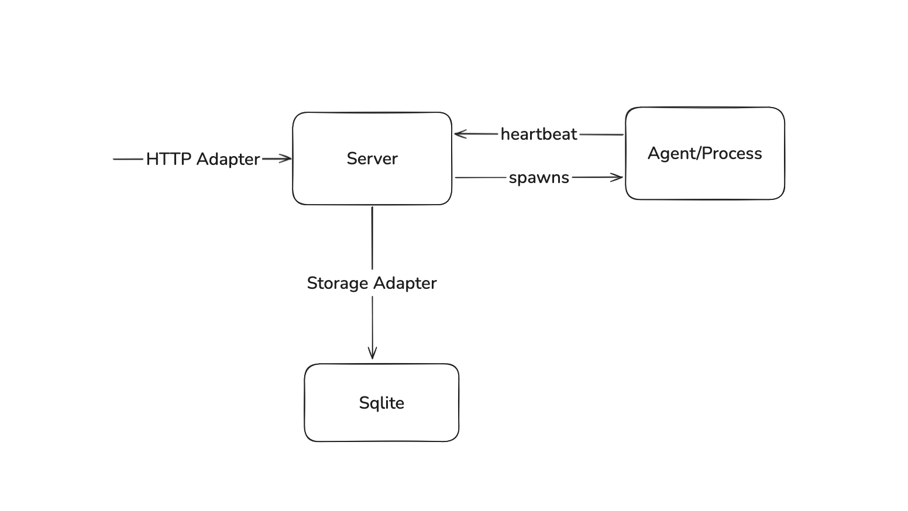

A simple CI/CD software

## Architecture

## Tech Stack

- Backend - Go
- Frontend - Mithril.js

## Scope

### Server

- [ ] Receive webhook from GitHub/GitLab via HTTP Adapter
- [ ] Store job in SQLite via Storage Adapter
- [ ] Marksman loop - Spawn agent process per job
- [ ] Expose heartbeat endpoint for agents
- [ ] Retry limit per job

### Agent

- [ ] Receive job ID on spawn
- [ ] Read job details from SQLite
- [ ] Execute .ci.yml steps sequentially
- [ ] Send heartbeat to server every N seconds
- [ ] Write logs to SQLite line by line
- [ ] Write final result (pass/fail) to SQLite
- [ ] Kill itself on completion

### Storage

- [ ] SQLite as default backend
- [ ] Storage adapter interface
- [ ] Tables: jobs, logs, heartbeats

### Pipeline Definition

- [ ] .trident.yml file in repo root
- [ ] Sequential steps only

### Dashboard

- [ ] List of pipeline runs with status and duration
- [ ] Live log viewer per run
- [ ] Agent status (running/idle/failed)
- [ ] Manual trigger per job
